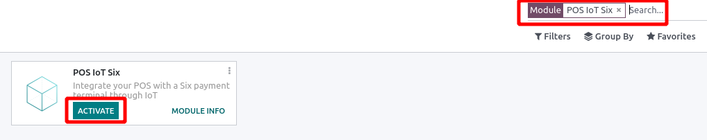
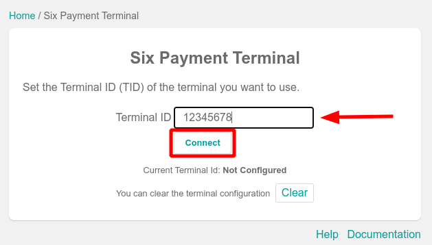
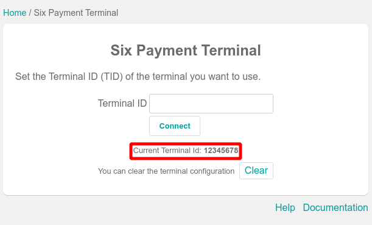
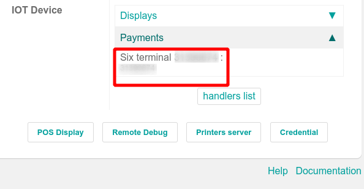
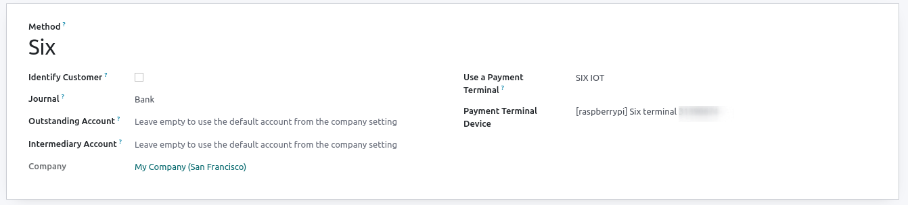
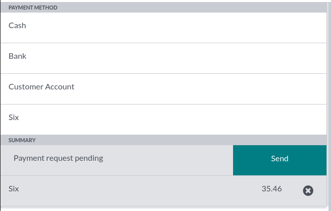

=======
Six IoT
=======

Connecting a Six payment terminal allows you to offer a fluid payment flow to your customers and ease
the work of your cashiers.

.. note::
   Please note that this module replaces the original :doc:`Pos Six module </applications/sales/point_of_sale/payment_methods/terminals/six>` previously used to communicate with Six terminals.

Configuration
=============

Install Six IoT Module
----------------------

From your database, go to :menuselection:`Apps --> Remove the "Apps" filter in search bar --> Search for "POS IoT Six" --> Click on "Activate"`.
This will add the necessary driver and interface to your database to be able to detect Six terminals.

Connect an IoT Box
------------------

Connecting a Six Payment Terminal to Odoo is a feature that requires an IoT Box. It is available both on Raspberry Pi IoT Box and Virtual (Windows) IoT Box. For more
information on how to connect one to your database, please refer to the
:doc:`IoT documentation </applications/productivity/iot/config/connect>`.

Configure the terminal id
-------------------------

Navigate to your IoT Box homepage.
Once your database server is connected to it a field **"Six payment terminal"** becomes visible.
Click on **"Configure"** button next to it.

.. image:: six_iot/six-iot-configure-tid-1.png
   :align: center

Enter the terminal id of your Six terminal and press **"Connect"**.

Your Six terminal should now appear in the "Current Terminal Id" section.

.. note::
   Odoo only accepts digits as valid input for `Six terminal id` field. If your input contains any non-digit characters it will be ignored.

.. example::
   | Here's a valid terminal id: `"12345678"`
   | Here's an invalid terminal id: `"1a2.3$4_"`

After the setup of Six terminal Id Odoo will automatically restart on the IoT Box.
At this point if your Six terminal is online it will be detected and connected by the IoT Box.
It will then appear under `"Payments"` section in the `"IOT Device"` part of the IoT Box homepage.

Configure the payment method
----------------------------

From the Point of Sale application, go to :menuselection:`Configuration --> Payment methods`
and create a new payment method for *Six*. Select the payment terminal *Six IoT* and your payment terminal device on your
*Payment Method form*.

Pay with a payment terminal
===========================

When processing a payment, select *Six* as payment method. Check the amount and click on
*Send*. Once the transaction is sent, you can cancel it by pressing "Cancel" button.
Once the payment is successful, the status changes to *Payment Successful*.

Once your payment is processed, the type of card used and the transaction ID appear on the payment
record.

.. tip::
   - You can only connect one Six terminal per IoT Box
   - Error messages related to Six terminal payments are generated by the Six terminal itself (Example: `"Wrong Pin"`)
   - The error messages use the language of the Six terminal, you can change the language by configuring the terminal (Contact Six)
   - The currency used for the transactions is the currency of your Point of Sale.
   - Default timeout for a Six transaction is 60 seconds. After 60 seconds without card insertion / payment an error will be sent to PoS.
   - If you want to connect the Six Terminal to a different IoT Box, you need to clear the Six Tid configuration on the IoT Box homepage first
   - The default communication with Six terminals is over TCP/IP connection.
   - Default port used is 7784.
